# 用户干预机制

<cite>
**本文档引用的文件**   
- [control_manager.js](file://background/managers/control_manager.js)
- [control_overlay.js](file://background/control/control_overlay.js)
- [breakpoint_overlay.js](file://background/control/breakpoint_overlay.js)
- [actions.js](file://background/control/actions.js)
- [base.js](file://background/control/actions/base.js)
- [wait_helper.js](file://background/control/wait_helper.js)
- [messages.js](file://background/messages.js)
- [session.js](file://background/handlers/session.js)
</cite>

## 目录
1. [简介](#简介)
2. [用户干预机制概述](#用户干预机制概述)
3. [核心组件分析](#核心组件分析)
4. [控制模式管理](#控制模式管理)
5. [断点机制](#断点机制)
6. [自动化流程中的用户干预](#自动化流程中的用户干预)
7. [错误处理与自动干预](#错误处理与自动干预)
8. [系统架构](#系统架构)
9. [交互流程](#交互流程)
10. [最佳实践](#最佳实践)

## 简介
本文档详细介绍了Gemini浏览器扩展中的用户干预机制。该机制允许人工智能自动化操作浏览器的同时，在必要时暂停自动化流程，等待用户手动干预，然后继续执行。这种设计平衡了自动化效率和用户控制权，确保在遇到验证码、登录页面或其他需要人类判断的场景时能够正确处理。

**Section sources**
- [control_manager.js](file://background/managers/control_manager.js#L1-L50)

## 用户干预机制概述
用户干预机制是Gemini浏览器扩展的核心功能之一，它实现了人工智能与用户之间的协作。当AI在执行自动化任务时遇到无法处理的情况（如验证码、登录页面等），系统会自动暂停自动化流程，显示控制面板，等待用户手动完成必要操作，然后继续由AI执行后续任务。

该机制主要由以下几个部分组成：
- **控制覆盖层**：在自动化过程中显示，阻止用户与页面交互，确保AI对浏览器的完全控制
- **断点覆盖层**：在需要用户干预时显示，允许用户与页面交互并完成必要操作
- **自动检测系统**：能够识别需要用户干预的特定页面元素（如验证码、登录表单等）
- **错误恢复机制**：在操作失败时自动请求用户帮助，并在用户干预后重试操作

**Section sources**
- [control_manager.js](file://background/managers/control_manager.js#L54-L95)
- [control_overlay.js](file://background/control/control_overlay.js#L8-L13)
- [breakpoint_overlay.js](file://background/control/breakpoint_overlay.js#L8-L15)

## 核心组件分析

### 控制管理器
控制管理器（BrowserControlManager）是用户干预机制的核心协调者，负责管理整个自动化流程的生命周期。它协调连接、快照、动作执行和用户干预等各个组件。

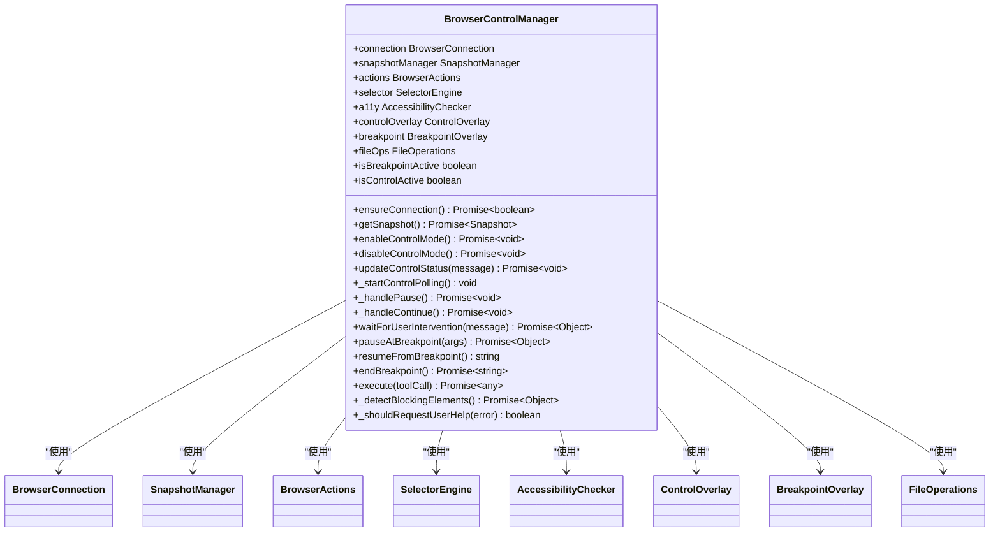

**Diagram sources **
- [control_manager.js](file://background/managers/control_manager.js#L16-L28)

**Section sources**
- [control_manager.js](file://background/managers/control_manager.js#L16-L28)

### 控制覆盖层
控制覆盖层（ControlOverlay）在AI控制浏览器时显示，阻止用户与页面交互，确保AI对浏览器的完全控制。它提供了一个带有呼吸动效的底部面板，包含暂停和继续按钮。

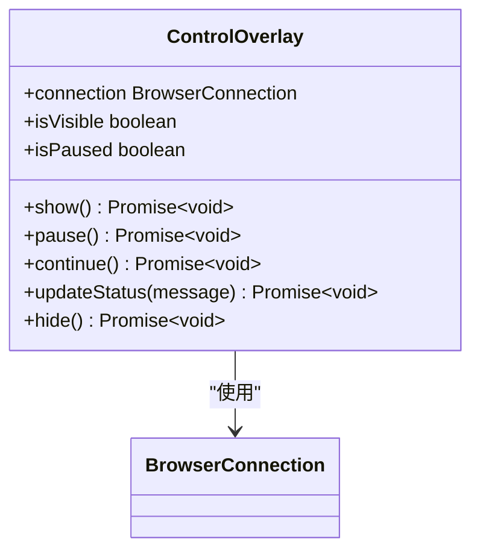

**Diagram sources **
- [control_overlay.js](file://background/control/control_overlay.js#L8-L13)

**Section sources**
- [control_overlay.js](file://background/control/control_overlay.js#L8-L13)

### 断点覆盖层
断点覆盖层（BreakpointOverlay）在需要用户干预时显示，允许用户与页面交互并完成必要操作。它提供了一个底部面板，包含暂停（允许编辑）和结束按钮。

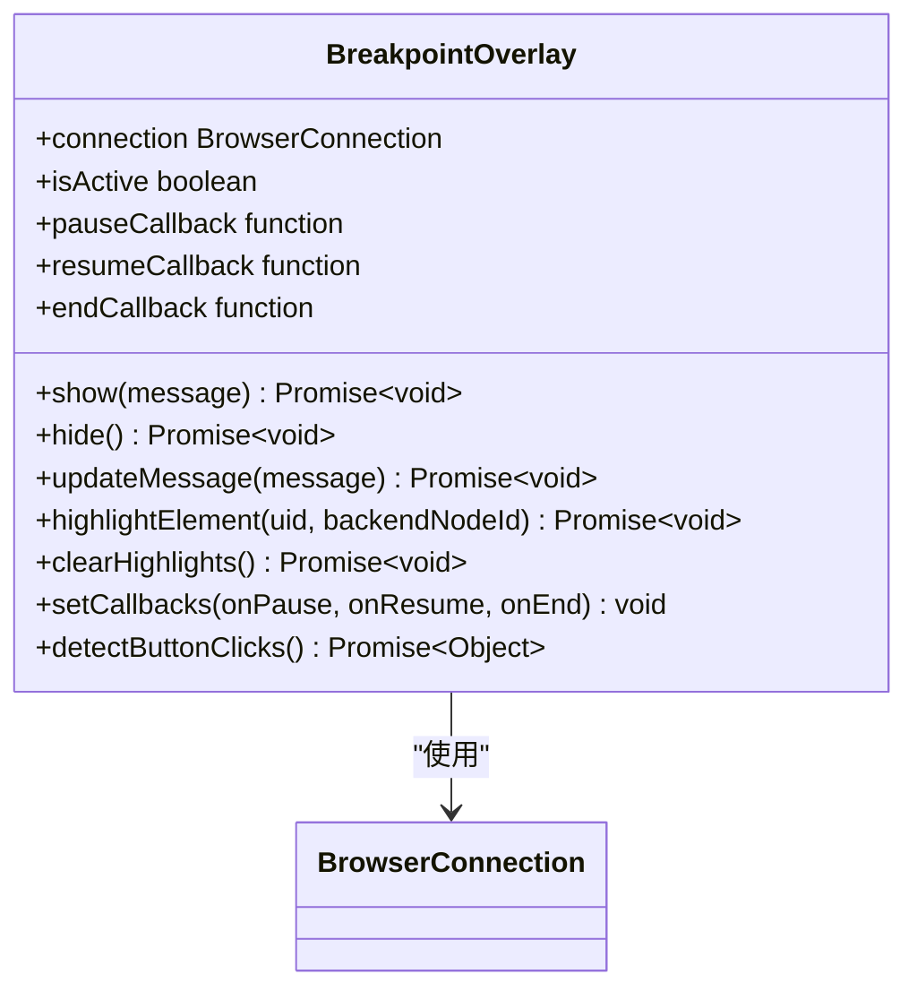

**Diagram sources **
- [breakpoint_overlay.js](file://background/control/breakpoint_overlay.js#L8-L15)

**Section sources**
- [breakpoint_overlay.js](file://background/control/breakpoint_overlay.js#L8-L15)

## 控制模式管理

### 启用控制模式
当AI开始执行自动化任务时，系统会启用控制模式。这会显示控制覆盖层，阻止用户与页面交互，确保AI对浏览器的完全控制。

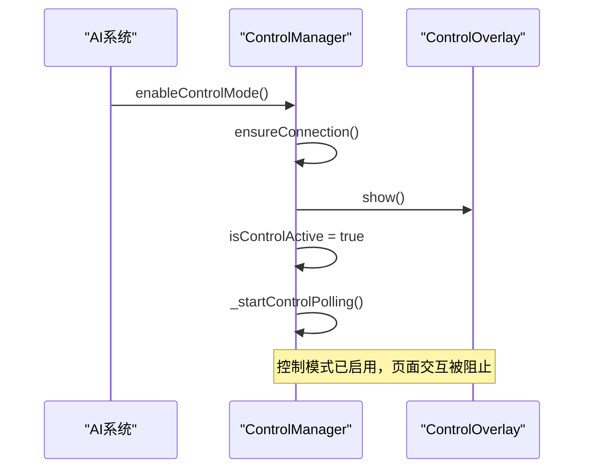

**Diagram sources **
- [control_manager.js](file://background/managers/control_manager.js#L55-L75)

**Section sources**
- [control_manager.js](file://background/managers/control_manager.js#L55-L75)

### 禁用控制模式
当自动化任务完成或被取消时，系统会禁用控制模式。这会隐藏控制覆盖层，恢复用户对页面的控制。

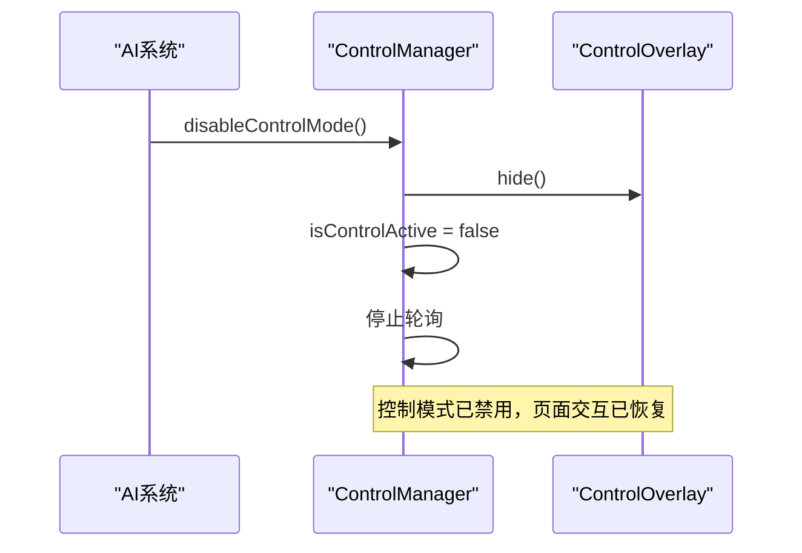

**Diagram sources **
- [control_manager.js](file://background/managers/control_manager.js#L77-L89)

**Section sources**
- [control_manager.js](file://background/managers/control_manager.js#L77-L89)

### 控制状态更新
在自动化过程中，系统会实时更新控制覆盖层上的状态消息，向用户显示当前AI正在执行的操作。

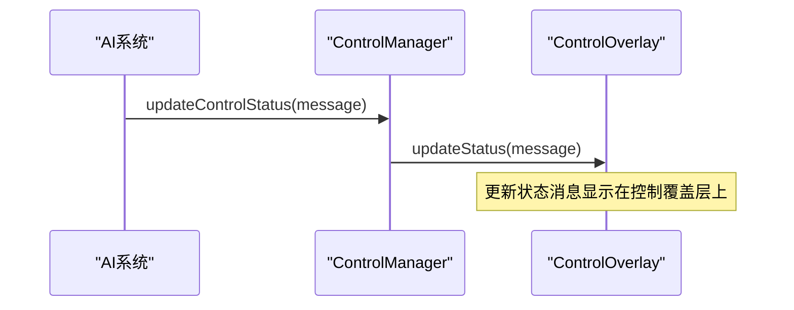

**Diagram sources **
- [control_manager.js](file://background/managers/control_manager.js#L91-L95)

**Section sources**
- [control_manager.js](file://background/managers/control_manager.js#L91-L95)

## 断点机制

### 暂停自动化
当需要用户干预时，系统会暂停自动化流程，允许用户与页面交互。这通过将控制覆盖层切换到暂停状态来实现。

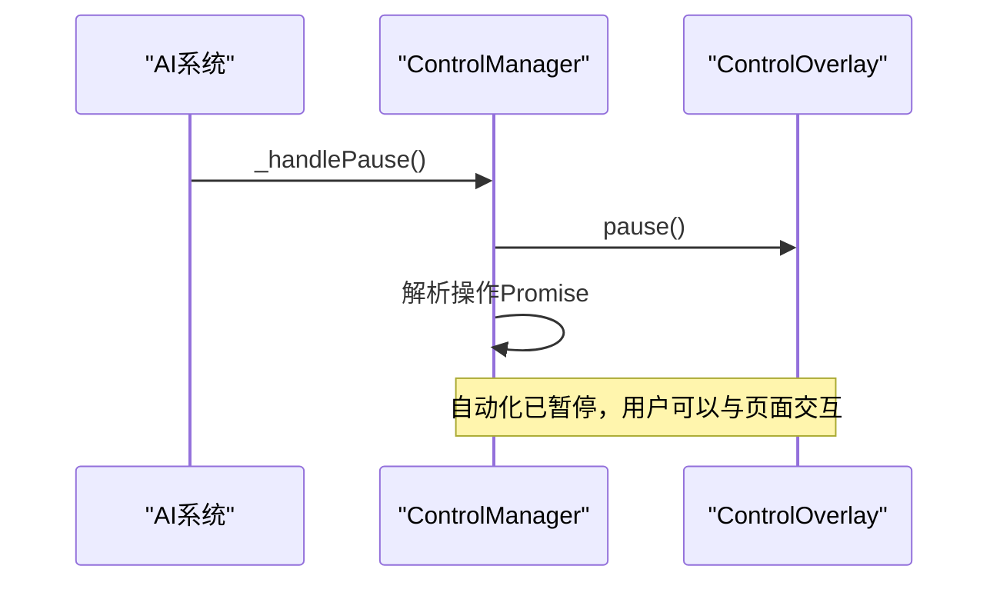

**Diagram sources **
- [control_manager.js](file://background/managers/control_manager.js#L136-L145)

**Section sources**
- [control_manager.js](file://background/managers/control_manager.js#L136-L145)

### 继续自动化
当用户完成必要操作并点击继续按钮后，系统会恢复自动化流程，AI重新获得对浏览器的控制。

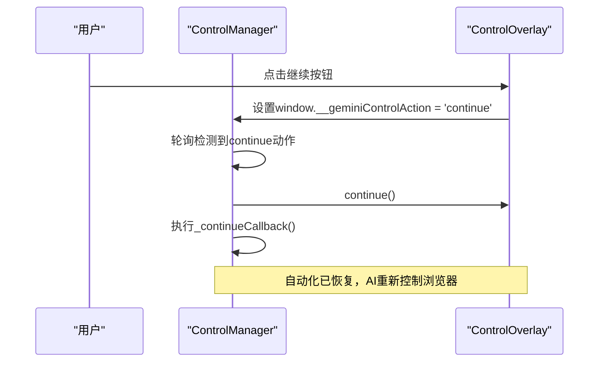

**Diagram sources **
- [control_manager.js](file://background/managers/control_manager.js#L149-L158)

**Section sources**
- [control_manager.js](file://background/managers/control_manager.js#L149-L158)

### 等待用户干预
系统提供了一个专门的方法来等待用户干预，这在遇到需要手动处理的情况时非常有用。

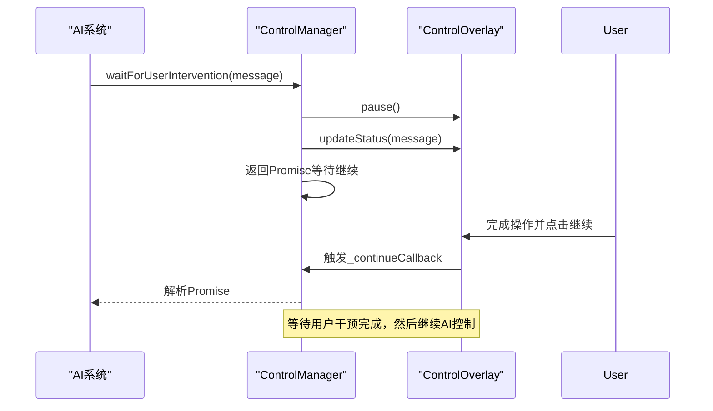

**Diagram sources **
- [control_manager.js](file://background/managers/control_manager.js#L165-L179)

**Section sources**
- [control_manager.js](file://background/managers/control_manager.js#L165-L179)

## 自动化流程中的用户干预

### 执行工具调用
当AI执行工具调用时，系统会自动检测是否需要用户干预，并在必要时暂停自动化流程。

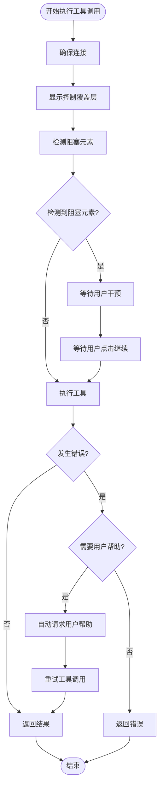

**Diagram sources **
- [control_manager.js](file://background/managers/control_manager.js#L267-L494)

**Section sources**
- [control_manager.js](file://background/managers/control_manager.js#L267-L494)

### 检测阻塞元素
系统能够自动检测需要用户干预的特定页面元素，如验证码、登录表单等。

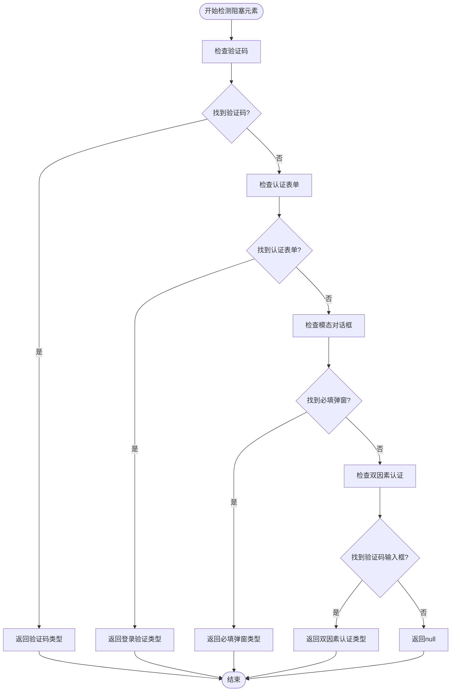

**Diagram sources **
- [control_manager.js](file://background/managers/control_manager.js#L501-L579)

**Section sources**
- [control_manager.js](file://background/managers/control_manager.js#L501-L579)

## 错误处理与自动干预

### 错误检测与用户帮助
当操作失败时，系统会根据错误类型决定是否需要请求用户帮助。

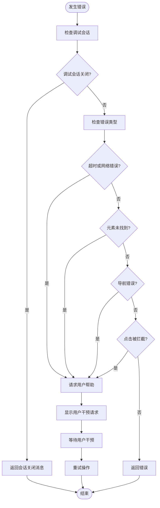

**Diagram sources **
- [control_manager.js](file://background/managers/control_manager.js#L467-L493)

**Section sources**
- [control_manager.js](file://background/managers/control_manager.js#L467-L493)

## 系统架构
用户干预机制是整个Gemini浏览器扩展架构的重要组成部分，与其他组件紧密协作。

```mermaid
graph TB
subgraph "背景脚本"
CM[ControlManager]
CO[ControlOverlay]
BO[BreakpointOverlay]
BA[BrowserActions]
SM[SessionManager]
MCP[MCPManager]
end
subgraph "内容脚本"
TC[ToolbarController]
UI[UI组件]
end
CM --> CO : "控制覆盖层"
CM --> BO : "断点覆盖层"
CM --> BA : "浏览器动作"
MCP --> CM : "执行工具调用"
SM --> MCP : "会话管理"
TC --> SM : "发送提示"
UI --> TC : "用户交互"
CO --> UI : "显示控制面板"
BO --> UI : "显示断点面板"
```

**Diagram sources **
- [index.js](file://background/index.js#L16-L26)
- [messages.js](file://background/messages.js#L17-L141)

**Section sources**
- [index.js](file://background/index.js#L16-L26)
- [messages.js](file://background/messages.js#L17-L141)

## 交互流程
用户干预机制的完整交互流程展示了AI与用户如何协作完成任务。

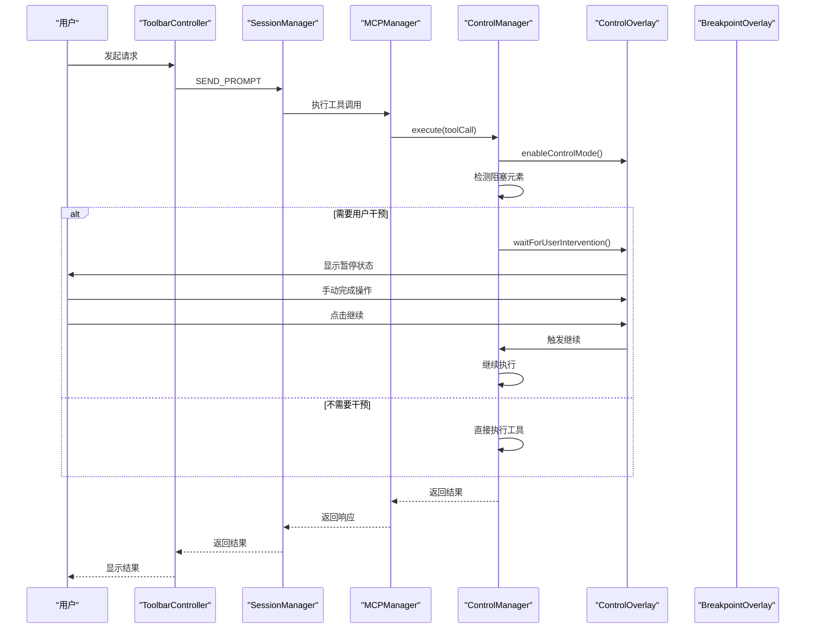

**Diagram sources **
- [session.js](file://background/handlers/session.js#L15-L54)
- [messages.js](file://background/messages.js#L129-L137)

**Section sources**
- [session.js](file://background/handlers/session.js#L15-L54)
- [messages.js](file://background/messages.js#L129-L137)

## 最佳实践
为了有效使用用户干预机制，建议遵循以下最佳实践：

1. **清晰的用户提示**：在需要用户干预时，提供清晰、具体的指示，告诉用户需要完成什么操作。
2. **合理的超时设置**：为用户干预设置合理的超时时间，避免无限期等待。
3. **错误恢复策略**：在用户干预后，系统应能够正确恢复并继续执行后续操作。
4. **状态可视化**：通过控制覆盖层清晰地显示当前状态（AI控制中、等待用户干预等）。
5. **无缝切换**：在AI控制和用户控制之间实现平滑切换，避免突兀的体验。
6. **自动检测优化**：不断优化阻塞元素的检测逻辑，提高自动识别需要用户干预情况的准确性。

**Section sources**
- [control_manager.js](file://background/managers/control_manager.js#L282-L289)
- [control_overlay.js](file://background/control/control_overlay.js#L246-L284)