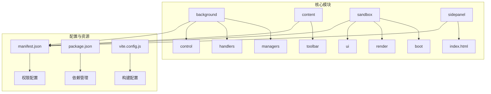
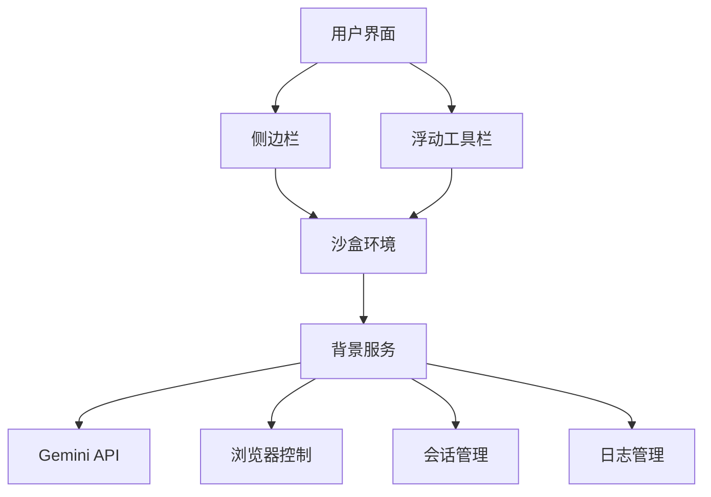
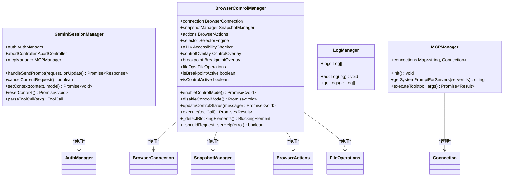
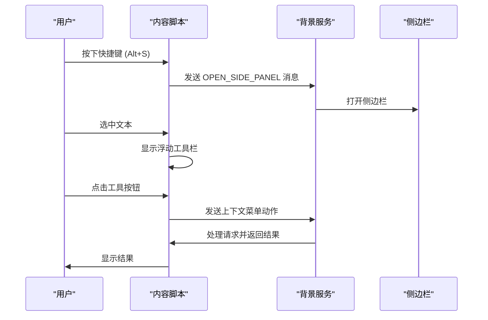
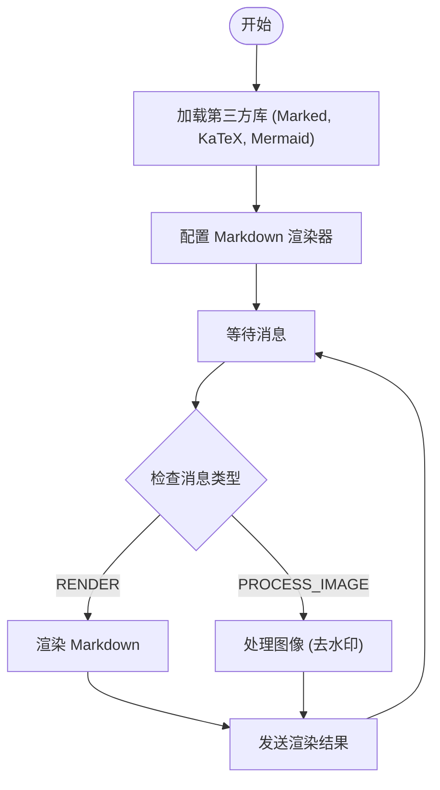

# 工作区设置

<cite>
**本文档中引用的文件**  
- [manifest.json](file://manifest.json)
- [package.json](file://package.json)
- [vite.config.js](file://vite.config.js)
- [metadata.json](file://metadata.json)
- [README.md](file://README.md)
- [background/index.js](file://background/index.js)
- [content/index.js](file://content/index.js)
- [sandbox/index.js](file://sandbox/index.js)
- [sidepanel/index.js](file://sidepanel/index.js)
- [lib/constants.js](file://lib/constants.js)
- [background/managers/session_manager.js](file://background/managers/session_manager.js)
- [background/managers/control_manager.js](file://background/managers/control_manager.js)
- [sandbox/boot/app.js](file://sandbox/boot/app.js)
- [sandbox/boot/renderer.js](file://sandbox/boot/renderer.js)
</cite>

## 目录
1. [简介](#简介)
2. [项目结构](#项目结构)
3. [核心组件](#核心组件)
4. [架构概述](#架构概述)
5. [详细组件分析](#详细组件分析)
6. [依赖分析](#依赖分析)
7. [性能考虑](#性能考虑)
8. [故障排除指南](#故障排除指南)
9. [结论](#结论)
10. [附录](#附录)（如有必要）

## 简介
Anywhere 是一款由 Google Gemini 驱动的强大 AI 助手 Chrome 扩展。该扩展提供侧边栏对话、智能总结、图像分析、文本选中工具、浏览器控制、会话管理等多种功能。本项目采用模块化设计，包含背景服务、内容脚本、沙盒环境、侧边栏界面等多个核心组件，通过现代化的构建工具 Vite 进行打包和部署。

## 项目结构
该项目具有清晰的模块化结构，主要分为以下几个部分：
- `background/`：服务工作者（Service Worker），负责 API 调用和会话管理。
- `content/`：内容脚本（Content Scripts），用于在网页上显示浮动工具栏。
- `sandbox/`：沙盒环境，用于安全地渲染 Markdown 内容。
- `sidepanel/`：侧边栏主界面。
- `services/`：Gemini API 服务。
- `css/`：样式文件。
- `lib/`：公共库和工具函数。



**Diagram sources**
- [manifest.json](file://manifest.json#L1-L93)
- [package.json](file://package.json#L1-L24)
- [vite.config.js](file://vite.config.js#L1-L95)

**Section sources**
- [manifest.json](file://manifest.json#L1-L93)
- [package.json](file://package.json#L1-L24)
- [vite.config.js](file://vite.config.js#L1-L95)
- [README.md](file://README.md#L1-L102)

## 核心组件
核心组件包括背景服务、内容脚本、沙盒环境和侧边栏界面。这些组件通过消息传递机制进行通信，实现了功能的解耦和安全隔离。

**Section sources**
- [background/index.js](file://background/index.js#L1-L30)
- [content/index.js](file://content/index.js#L1-L190)
- [sandbox/index.js](file://sandbox/index.js#L1-L12)
- [sidepanel/index.js](file://sidepanel/index.js#L1-L480)

## 架构概述
该扩展采用分层架构，前端界面与后端逻辑分离，通过沙盒环境确保内容渲染的安全性。



**Diagram sources**
- [background/index.js](file://background/index.js#L1-L30)
- [sidepanel/index.js](file://sidepanel/index.js#L1-L480)
- [sandbox/index.js](file://sandbox/index.js#L1-L12)

## 详细组件分析

### 背景服务分析
背景服务是扩展的核心，负责管理会话、控制浏览器、处理消息等。

#### 类图


**Diagram sources**
- [background/managers/session_manager.js](file://background/managers/session_manager.js#L1-L261)
- [background/managers/control_manager.js](file://background/managers/control_manager.js#L1-L622)

**Section sources**
- [background/index.js](file://background/index.js#L1-L30)
- [background/managers/session_manager.js](file://background/managers/session_manager.js#L1-L261)
- [background/managers/control_manager.js](file://background/managers/control_manager.js#L1-L622)

### 内容脚本分析
内容脚本负责在网页上注入浮动工具栏，并处理用户交互。

#### 序列图


**Diagram sources**
- [content/index.js](file://content/index.js#L1-L190)
- [background/index.js](file://background/index.js#L1-L30)

**Section sources**
- [content/index.js](file://content/index.js#L1-L190)
- [background/index.js](file://background/index.js#L1-L30)

### 沙盒环境分析
沙盒环境用于安全地渲染 Markdown 内容，防止 XSS 攻击。

#### 流程图


**Diagram sources**
- [sandbox/boot/renderer.js](file://sandbox/boot/renderer.js#L1-L72)
- [sandbox/boot/app.js](file://sandbox/boot/app.js#L1-L93)

**Section sources**
- [sandbox/boot/renderer.js](file://sandbox/boot/renderer.js#L1-L72)
- [sandbox/boot/app.js](file://sandbox/boot/app.js#L1-L93)

## 依赖分析
项目依赖关系清晰，主要依赖包括：
- `d3`：用于数据可视化。
- `html2canvas`：用于将 DOM 元素转换为 Canvas。
- `markmap-lib` 和 `markmap-view`：用于生成交互式思维导图。
- `mermaid`：用于渲染流程图、序列图等。

```mermaid
graph LR
A[项目] --> B[d3]
A --> C[html2canvas]
A --> D[markmap-lib]
A --> E[markmap-view]
A --> F[mermaid]
A --> G[@types/node]
A --> H[typescript]
A --> I[vite]
```

**Diagram sources**
- [package.json](file://package.json#L1-L24)

**Section sources**
- [package.json](file://package.json#L1-L24)
- [vite.config.js](file://vite.config.js#L1-L95)

## 性能考虑
项目在性能方面做了多项优化：
- 使用 Vite 进行快速构建和热更新。
- 在侧边栏中使用 localStorage 缓存主题和语言设置，实现即时加载。
- 采用异步数据获取，避免阻塞主线程。
- 对图像处理和 Markdown 渲染进行沙盒隔离，防止影响主页面性能。

## 故障排除指南
常见问题及解决方案：
- **无法打开侧边栏**：检查是否启用了开发者模式，并正确加载了扩展。
- **快捷键无效**：确认快捷键未被其他扩展占用。
- **图像分析失败**：检查网络连接，确保可以访问 Gemini API。
- **会话丢失**：尝试清除本地存储并重新登录。

**Section sources**
- [background/index.js](file://background/index.js#L1-L30)
- [content/index.js](file://content/index.js#L1-L190)
- [sidepanel/index.js](file://sidepanel/index.js#L1-L480)

## 结论
Anywhere 扩展通过模块化设计和现代化的构建工具，实现了功能丰富且性能优良的 AI 助手。其清晰的架构和良好的代码组织使得维护和扩展变得容易。未来可以进一步优化用户体验，增加更多实用功能。

## 附录
### 配置选项
| 配置项 | 描述 | 默认值 |
|--------|------|--------|
| geminiShortcuts | 快捷键设置 | {quickAsk: "Ctrl+G", openPanel: "Alt+S"} |
| geminiTextSelectionEnabled | 是否启用文本选中工具 | true |
| geminiImageToolsEnabled | 是否启用图像工具 | true |
| geminiTheme | 主题设置 | system |
| geminiLanguage | 语言设置 | system |

### 状态定义
- **Control Mode**: 浏览器控制模式，AI 可以操作浏览器。
- **Breakpoint Active**: 断点激活状态，等待用户干预。
- **User Intervention**: 用户干预状态，需要手动完成任务。