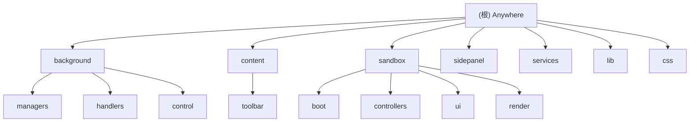

# Anywhere - Chrome 扩展项目文档

> **变更记录 (Changelog)**
> - 2026-01-03 17:12:45: 初始化项目文档，建立架构索引与模块导航

## 项目愿景

Anywhere（原名 Gemini Nexus）是一款强大的 AI 助手 Chrome 扩展，由 Google Gemini 驱动。为用户提供随时随地的智能对话、网页总结、图像分析、文本处理和浏览器自动化控制能力。

**核心价值**：
- 无缝集成 - 在浏览器中随时调用 AI 能力
- 多模态交互 - 支持文本、图片、思维导图等多种形式
- 智能控制 - AI 可直接操作浏览器执行复杂任务
- 扩展性强 - 支持 MCP (Model Context Protocol) 协议对接外部工具

## 架构总览

**技术栈**：
- **运行时**：Chrome Extension Manifest V3
- **构建工具**：Vite 6.2.0
- **语言**：JavaScript (ES Module)
- **UI 渲染**：Vanilla JS + Sandbox 隔离环境
- **可视化库**：D3.js, Mermaid, Markmap, KaTeX

**分层架构**：
```
Extension Runtime (Chrome API)
    ├── Background Service Worker (后台核心逻辑)
    ├── Content Scripts (网页注入脚本)
    ├── Sidepanel (侧边栏桥接层)
    └── Sandbox (安全的 UI 渲染环境)
```

### 模块结构图



## 模块索引

| 模块 | 路径 | 职责 | 入口文件 | 语言 |
|------|------|------|----------|------|
| **Background** | `background/` | 后台服务 Worker，管理 Gemini API 调用、会话、认证、浏览器控制 | `background/index.js` | JavaScript |
| **Content** | `content/` | 注入到网页的脚本，提供浮动工具栏、文本选择、截图裁剪 | `content/index.js` | JavaScript |
| **Sandbox** | `sandbox/` | 沙盒 UI 环境，安全渲染 Markdown、Mermaid、LaTeX 等内容 | `sandbox/index.js` | JavaScript |
| **Sidepanel** | `sidepanel/` | 侧边栏桥接层，连接 Sandbox 和 Background | `sidepanel/index.js` | JavaScript |
| **Services** | `services/` | Gemini API 封装、认证、上传、解析等核心服务 | `services/gemini_api.js` | JavaScript |
| **Lib** | `lib/` | 通用工具库（日志、常量、消息通信、图像处理） | - | JavaScript |
| **CSS** | `css/` | 全局样式文件（主题、组件、布局） | - | CSS |

## 运行与开发

### 开发模式

```bash
# 安装依赖
npm install

# 开发构建（监听模式）
npm run dev

# 生产构建
npm run build
```

### 加载扩展

1. 打开 Chrome，访问 `chrome://extensions/`
2. 开启「开发者模式」
3. 点击「加载已解压的扩展程序」
4. 选择项目根目录（或 `dist/` 目录，取决于构建配置）
5. 确保已在 [gemini.google.com](https://gemini.google.com) 登录 Google 账号

### 快捷键

| 操作 | 快捷键 | 说明 |
|------|--------|------|
| 打开侧边栏 | `Alt + S` | 打开 AI 对话侧边栏 |
| 快速提问 | `Ctrl + G` | 在当前页面快速弹出输入框 |
| 聚焦输入框 | `Ctrl/Cmd + P` | 聚焦到对话输入框 |

### 构建产物

- **入口文件**：
  - `background/index.js` - Service Worker
  - `sandbox/index.html` - 沙盒 UI
  - `sidepanel/index.html` - 侧边栏界面
  - `content/index.js` - 内容脚本主入口

- **构建工具**：Vite（配置在 `vite.config.js`）
- **输出目录**：`dist/`（包含完整扩展包）

## 测试策略

**当前状态**：无自动化测试框架

**测试方式**：
- 手动测试：加载扩展到 Chrome 进行功能验证
- 调试工具：Chrome DevTools（Service Worker、Content Scripts）
- 日志系统：集成 `LogManager`，可在设置中查看运行日志

**建议补充**：
- 单元测试：使用 Vitest 或 Jest
- E2E 测试：使用 Puppeteer 或 Playwright
- 集成测试：测试 Background <-> Content <-> Sandbox 消息流

## 编码规范

**风格**：
- ES Module (`import/export`)
- 使用 `async/await` 处理异步逻辑
- 类优先（Manager、Controller、Handler 等）
- 消息驱动架构（Chrome Runtime Messaging）

**命名约定**：
- 类名：PascalCase（如 `GeminiSessionManager`）
- 文件名：snake_case（如 `session_manager.js`）
- 常量：UPPER_SNAKE_CASE（如 `DEFAULT_SHORTCUTS`）

**目录结构**：
- `managers/` - 管理器类（生命周期长，单例或全局）
- `handlers/` - 消息/事件处理器
- `controllers/` - UI 控制器
- `services/` - 外部 API 调用封装
- `lib/` - 工具函数与常量

## AI 使用指引

### 对话流程

1. **用户输入** → Content/Sidepanel
2. **消息转发** → Background (via Chrome Runtime Messaging)
3. **API 调用** → Services (`gemini_api.js` 调用 Gemini API)
4. **流式响应** → Background 接收 SSE 流
5. **渲染展示** → Sandbox 渲染 Markdown/Mermaid

### 关键依赖

- **Gemini API**：通过逆向工程封装的 HTTP 接口（非官方 SDK）
- **MCP 协议**：支持外部工具调用（如文件操作、代码执行）
- **浏览器控制**：基于 Chrome Debugger Protocol（CDP）实现 AI 自动化

### 数据存储

- **会话数据**：`chrome.storage.local` (`geminiSessions`)
- **配置项**：主题、语言、快捷键、模型选择等
- **认证信息**：从 Gemini 网页提取 Cookie 和 Context

## 安全与隐私

- **沙盒隔离**：UI 渲染在 Sandbox 环境中，避免 XSS 风险
- **CSP 策略**：严格的内容安全策略（见 `manifest.json`）
- **权限最小化**：仅申请必要的 Chrome 权限（`sidePanel`, `storage`, `debugger` 等）
- **本地处理**：对话数据存储在本地，不上传到第三方服务器

## 相关链接

- **README**: [README.md](./README.md)
- **构建配置**: [vite.config.js](./vite.config.js)
- **扩展清单**: [manifest.json](./manifest.json)
- **包管理**: [package.json](./package.json)

---

**最后更新**: 2026-01-03
**项目版本**: 4.0.0
**维护者**: SEVENTEEN-TAN
