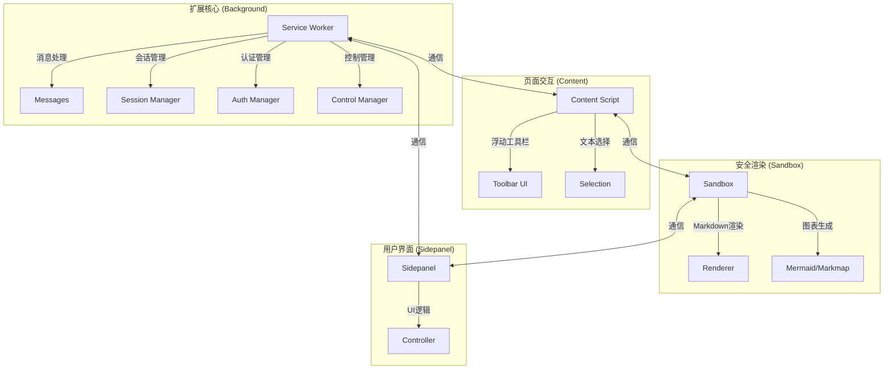

<div align="center">
  
  <h1>AnyWhere</h1>
  
  [](https://github.com/SEVENTEEN-TAN/AnyWhere/releases)
  [](LICENSE)

  <p>🚀 一款强大的 AI 助手 Chrome 扩展，由 Google Gemini 驱动</p>
  <p>
    <a href="#features">功能</a> •
    <a href="#installation">安装</a> •
    <a href="#architecture">架构</a> •
    <a href="#usage">使用</a>
  </p>
</div>

---

<a id="features"></a>
## ✨ 核心功能 (Core Features)

### 🤖 侧边栏 AI 助手 (Sidepanel Chat)
随时唤起的智能助手，深度集成于浏览器侧边栏。
- **多模态交互**：支持文字、图片拖拽上传、文件（PDF/CSV/TXT）分析。
- **上下文感知**：点击“页面上下文”按钮，AI 即可读取并理解当前网页内容，进行针对性问答。
- **会话管理**：自动保存历史对话，支持搜索、重命名与恢复。
- **模型矩阵**：内置支持 `Gemini 1.5 Pro`, `Gemini 1.5 Flash`, `Gemini 2.0 Flash` 等最新模型。
- **Gems 支持**：无缝加载您的 Google Gems 自定义助手。

### 🪄 悬浮工具栏 (Floating Toolbar)
选中网页文本即可触发，提供即时 AI 辅助（支持拖拽移动）。
- **Ask AI**：对选中内容进行自定义提问。
- **Explain**：深度解释专业术语或复杂段落。
- **Translate**：智能翻译选中内容。
- **Summarize**：生成选中段落的摘要。
- **交互操作**：生成结果支持一键复制，或在输入框场景下直接**插入/替换**原文。

### 🖼️ 智能图像工具 (Smart Image Tools)
鼠标悬停在网页图片上，自动浮现 AI 工具菜单。
- **Chat with Image**：直接对该图片发起对话。
- **Describe**：生成图片的详细描述/Alt 文本。
- **Extract Text (OCR)**：精准提取图片中的文字内容。
- **高级处理**：支持去背景、去文字、画质增强（Upscale）等功能。

### 🧠 智能网页总结 (Web Summary)
- **全文摘要**：一键提炼长文核心观点。
- **思维导图**：自动将网页内容转化为 **Markmap 思维导图**。
  - **可视化交互**：支持节点缩放、拖拽与展开/收起。
  - **导出功能**：支持导出为 **PNG 图片** 或复制为 **层级文本** (Outline)，方便笔记整理。

### 🌐 浏览器自动化 (Browser Control / MCP)
基于 MCP (Model Context Protocol) 协议的浏览器控制能力。
- **自然语言操控**：通过指令控制浏览器导航、点击元素、输入内容。
- **自动化任务**：支持复杂的跨页面任务执行与截图验证。

## 🛡️ 技术特性 (Technical Highlights)

- **富文本渲染**：完美支持 Markdown、代码高亮、LaTeX 数学公式、Mermaid 图表与 Markmap 思维导图。
- **隐私优先**：对话历史仅存储于本地浏览器（Chrome Storage），API Key 安全管理，不经过第三方服务器。
- **安全沙箱**：所有 AI 生成内容的渲染均在隔离的 Sandbox 环境中执行，杜绝 XSS 风险，保障主页面安全。

<a id="installation"></a>
## 🛠️ Installation

### 开发模式

1. **克隆仓库**
   ```bash
   git clone https://github.com/SEVENTEEN-TAN/AnyWhere.git
   cd AnyWhere
   ```

2. **安装依赖**
   ```bash
   npm install
   ```

3. **加载扩展**
   - 打开 Chrome，访问 `chrome://extensions/`
   - 开启「开发者模式」
   - 点击「加载已解压的扩展程序」
   - 选择项目根目录

4. **登录 Gemini**
   - 确保已在 [gemini.google.com](https://gemini.google.com) 登录 Google 账号

<a id="architecture"></a>
## 🏗️ Architecture

### 系统架构图



### 核心组件说明

- **Background (后台服务)**: 扩展的大脑，负责管理会话状态、处理 Gemini API 通信、执行浏览器自动化指令，并协调各个组件间的消息传递。
- **Content Script (内容脚本)**: 注入到网页的前端触角，负责监听用户选区、渲染浮动工具栏，并作为桥梁连接页面与后台。
- **Sandbox (沙箱环境)**: 一个受限的安全执行环境，专门用于解析 Markdown、渲染 LaTeX 公式和执行不可信的第三方可视化代码，防止 XSS 攻击。
- **Sidepanel (侧边栏)**: 用户与 AI 交互的主要窗口，承载了对话流、设置面板和历史记录管理。

### 目录结构

```
AnyWhere/
├── background/          # Service Worker (API 调用、会话管理、MCP 实现)
│   ├── handlers/        # 消息路由与处理器
│   └── managers/        # 核心业务逻辑 (Auth, Session, Control)
├── content/             # Content Scripts (注入页面的逻辑)
│   └── toolbar/         # 浮动工具栏 UI 与交互
├── sandbox/             # 沙盒环境 (Markdown/Mermaid 安全渲染)
│   ├── boot/            # 启动引导
│   └── render/          # 渲染引擎配置
├── sidepanel/           # 侧边栏主界面 (Vue/Vanilla JS)
├── services/            # 外部服务集成 (Gemini API, Gems)
└── css/                 # 全局样式与组件样式
```

## 🔌 API 与服务 (Services)

本项目不依赖官方付费 API Key，而是通过逆向工程封装了网页版 Gemini 的接口，实现免费且强大的 AI 能力。

- **Gemini API**: 封装了 `gemini.google.com` 的通信协议，支持流式响应 (SSE) 和多模态上传。
- **Auth Manager**: 自动从浏览器 Cookie 中提取认证凭证 (SNLM0e)，实现无感登录。
- **MCP Manager**: 实现了模型上下文协议 (Model Context Protocol)，允许 AI 调用浏览器原生能力（如截图、导航、DOM 操作）。

<a id="changelog"></a>
## 📅 更新日志 (Changelog)

### v4.1.1 (Current)
- **🔧 Fixes**:
  - 修复生产环境构建后 Markdown 渲染失效的问题（修复 `vendor` 依赖缺失）。
- **✨ New Features**:
  - **Mindmap 增强**：新增思维导图导出为 PNG 图片功能。
  - **文本导出**：支持将思维导图结构一键复制为层级文本。
- **⚡ Improvements**:
  - 优化构建配置，确保静态资源正确打包。

### v4.1.0
- **🎉 Rebranding**: 项目正式更名为 **AnyWhere**。
- **✨ New Features**:
  - 新增元素选择器 (Element Picker)，支持精准捕获网页特定区域作为上下文。
  - 引入 Markmap 思维导图支持，网页总结自动生成可视化图表。
  - 增强沙箱安全性，所有外链强制在新标签页打开。
- **⚡ Improvements**:
  - 优化滚动捕获逻辑，支持长页面完整读取。
  - 改进 Markdown 渲染引擎，修复转义字符显示问题。

### v3.x (Legacy)
- **Gemini Nexus**: 初始版本，确立了侧边栏+浮动工具栏的双交互模式。
- 集成 Google Gems 模型列表。
- 实现基础的浏览器控制功能。

<a id="usage"></a>
## 📖 使用指南 (Usage)

### ❓ 常见问题 (FAQ)

**Q: 为什么提示“未登录”？**
A: 请确保您已在 Chrome 中登录 [gemini.google.com](https://gemini.google.com)。扩展会自动同步您的登录状态。如果仍有问题，请尝试刷新 Gemini 页面。

**Q: 浮动工具栏不显示？**
A: 部分网站可能因 CSP (内容安全策略) 或样式冲突导致工具栏被遮挡。您可以尝试刷新页面，或在设置中检查“文本选中工具”是否已启用。

**Q: 如何切换模型？**
A: 在侧边栏对话框上方或设置面板中，您可以选择 `Gemini 1.5 Pro` (推荐)、`Flash` (速度快) 或其他可用模型。

### 🚀 快捷键

| 操作 | 快捷键 | 说明 |
|------|--------|------|
| **打开侧边栏** | `Alt + S` | 快速唤起/隐藏 AI 助手面板 |
| **聚焦输入框** | `Ctrl/Cmd + P` | 在侧边栏打开时，快速聚焦对话输入框 |

### 🛠️ 工具操作指引

#### 1. 文本交互
在任意网页选中文本，工具栏即刻出现：
- 点击 **Ask AI** 图标，在弹窗中输入问题。
- 点击 **Explain** / **Translate** 快速获取结果。
- 结果窗口支持拖拽，点击底部 **Copy** 复制，或使用 **Replace** 替换选中文本（仅限输入框区域）。

#### 2. 图像交互
- 鼠标悬停在网页图片上，点击左上角浮现的 **AnyWhere Logo**。
- 选择 **Describe** 获取图片描述，或 **Chat** 进行深入对话。
- 选择 **Extract Text** 提取图中文字，支持直接复制。

#### 3. 网页总结
- 点击侧边栏输入框上方的 **Summarize** 按钮。
- AI 将自动读取全文并生成摘要。
- 摘要下方会自动生成 **思维导图**，点击节点可折叠/展开，右上角支持下载。

#### 4. 浏览器控制
- 点击侧边栏的 **Browser Control** 按钮（或输入指令如 "帮我搜索..."）。
- 授权后，AI 可接管浏览器进行搜索、翻页、提取信息等操作。

## 🔧 Configuration

在设置面板中可配置：

- **模型选择** - 切换 Gemini 模型 (Flash/Pro)
- **账号索引** - 多账号切换
- **工具开关** - 启用/禁用文本选中工具、图像工具

## 📄 License

MIT License

---

<div align="center">
  <sub>Made with ❤️ by SEVENTEEN-TAN</sub>
</div>
