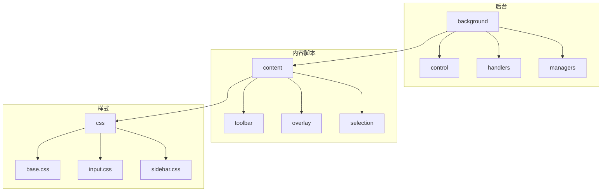
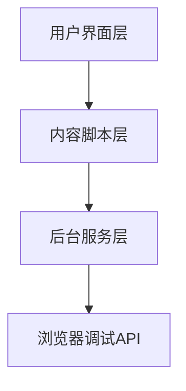
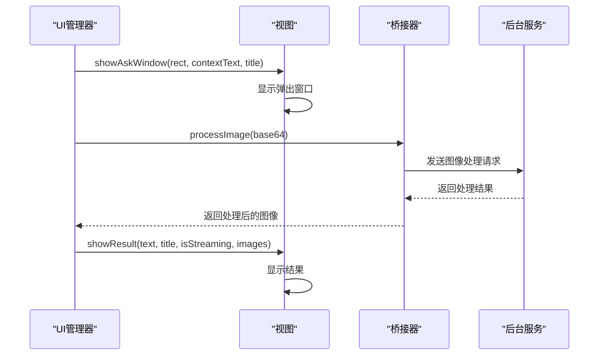
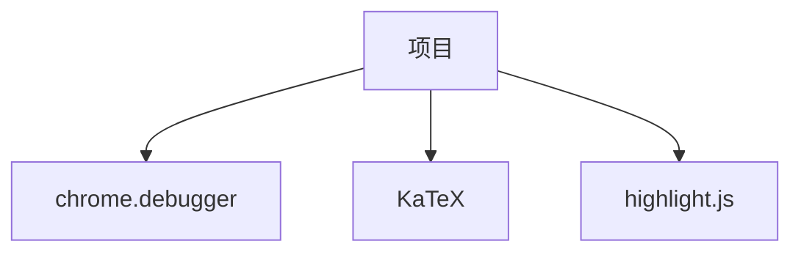

# 可访问性审计

<cite>
**本文档中引用的文件**  
- [a11y.js](file://background/control/a11y.js)
- [connection.js](file://background/control/connection.js)
- [manager.js](file://content/toolbar/ui/manager.js)
- [index.js](file://content/toolbar/view/index.js)
- [dom.js](file://content/toolbar/view/dom.js)
- [base.css](file://css/base.css)
- [input.css](file://css/input.css)
- [sidebar.css](file://css/sidebar.css)
- [header.js](file://content/toolbar/styles/panel/header.js)
- [body.js](file://content/toolbar/styles/panel/body.js)
</cite>

## 目录
1. [简介](#简介)
2. [项目结构](#项目结构)
3. [核心组件](#核心组件)
4. [架构概述](#架构概述)
5. [详细组件分析](#详细组件分析)
6. [依赖分析](#依赖分析)
7. [性能考虑](#性能考虑)
8. [故障排除指南](#故障排除指南)
9. [结论](#结论)

## 简介
本项目是一个浏览器扩展，提供可访问性审计功能，旨在帮助用户检查网页是否符合WCAG 2.1 AA级别的可访问性标准。该扩展通过自动化检查来识别潜在的可访问性问题，并提供可操作的建议。核心功能包括颜色对比度检查、标题层级验证、表单标签检查、替代文本检查、ARIA属性验证、键盘导航支持以及焦点可见性检查。

## 项目结构
项目采用模块化结构，主要分为以下几个部分：
- **background**: 包含后台脚本，负责处理与浏览器调试API的连接、可访问性检查、动作控制等。
- **content**: 包含内容脚本，负责在页面上注入UI组件、处理用户交互、管理工具栏等。
- **css**: 包含样式表，定义了扩展的视觉外观，包括基础样式、聊天界面、输入框、侧边栏等。
- **lib**: 包含工具函数和常量。
- **sandbox**: 包含沙箱环境，用于安全地渲染内容。
- **services**: 包含与外部服务通信的API。
- **sidepanel**: 包含侧边栏的HTML和JavaScript文件。



**Diagram sources**
- [manifest.json](file://manifest.json)

## 核心组件
核心组件包括可访问性检查器、浏览器连接管理器、UI管理器等。这些组件协同工作，确保扩展能够有效地执行可访问性审计。

**Section sources**
- [a11y.js](file://background/control/a11y.js)
- [connection.js](file://background/control/connection.js)
- [manager.js](file://content/toolbar/ui/manager.js)

## 架构概述
系统架构分为三个主要层次：后台服务层、内容脚本层和用户界面层。后台服务层负责与浏览器调试API通信，执行可访问性检查；内容脚本层负责在页面上注入UI组件并处理用户交互；用户界面层则提供直观的用户界面，使用户能够轻松地进行可访问性审计。



**Diagram sources**
- [a11y.js](file://background/control/a11y.js)
- [connection.js](file://background/control/connection.js)
- [manager.js](file://content/toolbar/ui/manager.js)

## 详细组件分析

### 可访问性检查器分析
可访问性检查器是本项目的核心组件之一，负责执行各种可访问性检查。它通过调用浏览器调试API来获取页面信息，并根据WCAG 2.1 AA标准进行评估。

#### 类图
```mermaid
classDiagram
class AccessibilityChecker {
+constructor(connection)
+audit() Promise~{issues : Array, summary : string, score : number}~
+checkContrast()
+checkHeadings()
+checkFormLabels()
+checkAltText()
+checkAriaAttrs()
+checkKeyboardNav()
+checkFocusVisible()
+checkColorDependence()
+generateReport()
}
class BrowserConnection {
+constructor()
+attach(tabId)
+detach()
+sendCommand(method, params)
+startTracing(categories)
+stopTracing()
}
AccessibilityChecker --> BrowserConnection : "uses"
```

**Diagram sources**
- [a11y.js](file://background/control/a11y.js)
- [connection.js](file://background/control/connection.js)

### UI管理器分析
UI管理器负责管理扩展的用户界面，包括工具栏、弹出窗口、图像按钮等。它通过事件监听和回调机制与后台服务层进行通信。

#### 序列图


**Diagram sources**
- [manager.js](file://content/toolbar/ui/manager.js)
- [index.js](file://content/toolbar/view/index.js)
- [dom.js](file://content/toolbar/view/dom.js)

## 依赖分析
项目依赖于Chrome浏览器的调试API，通过`chrome.debugger`接口与页面进行交互。此外，还依赖于一些第三方库，如KaTeX用于数学公式渲染，highlight.js用于代码高亮。



**Diagram sources**
- [manifest.json](file://manifest.json)
- [dom.js](file://content/toolbar/view/dom.js)

## 性能考虑
为了提高性能，项目采用了多种优化策略。例如，在执行可访问性检查时，使用`Promise.all`并行执行多个检查任务，以减少总体执行时间。此外，通过缓存DOM元素和避免不必要的重绘来优化UI性能。

## 故障排除指南
如果遇到问题，可以尝试以下步骤：
1. 确保浏览器支持调试API。
2. 检查扩展是否有足够的权限。
3. 查看控制台日志，寻找错误信息。
4. 尝试重新加载页面或重启浏览器。

**Section sources**
- [connection.js](file://background/control/connection.js)
- [manager.js](file://content/toolbar/ui/manager.js)

## 结论
本项目提供了一个全面的可访问性审计工具，能够帮助开发者和设计师确保其网页符合WCAG 2.1 AA标准。通过自动化检查和直观的用户界面，用户可以轻松地发现和修复可访问性问题。未来的工作可以包括增加更多的检查项、支持更多语言和改进用户体验。