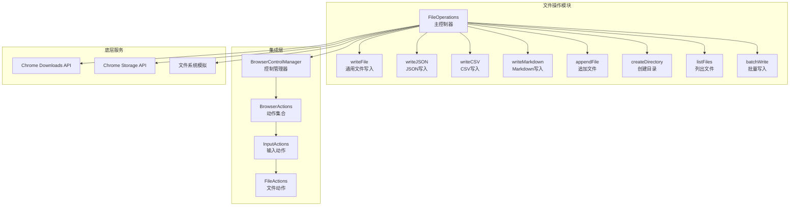
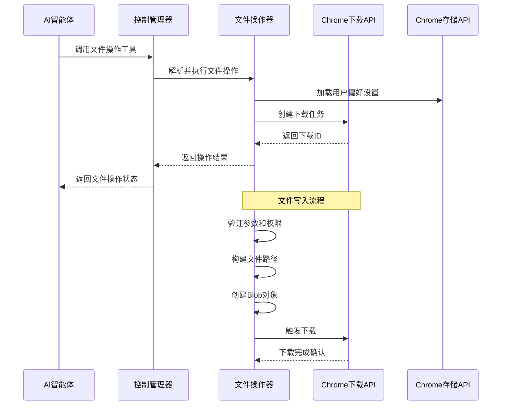
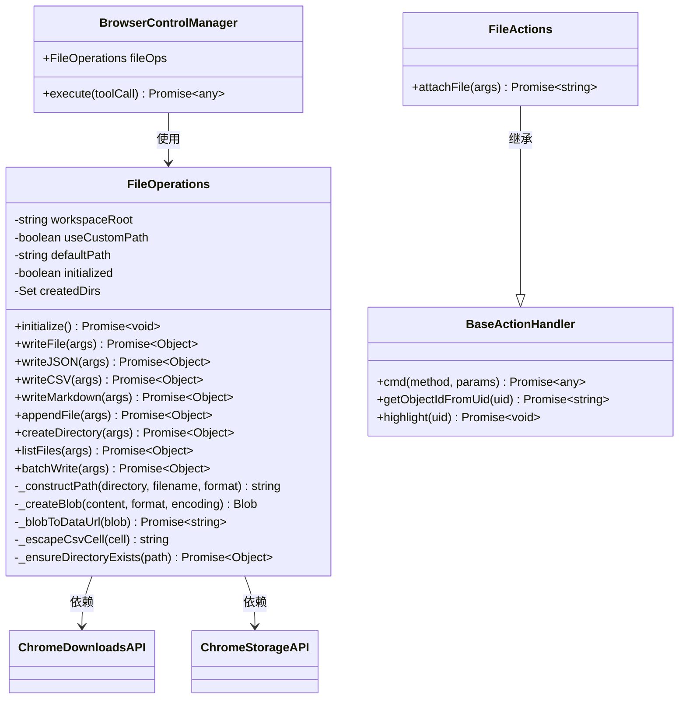
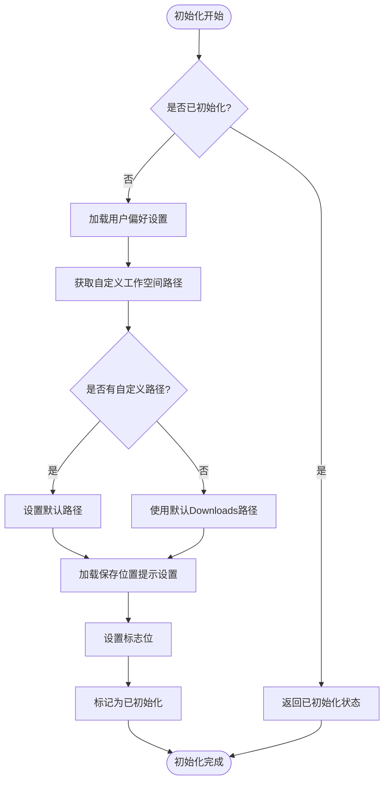
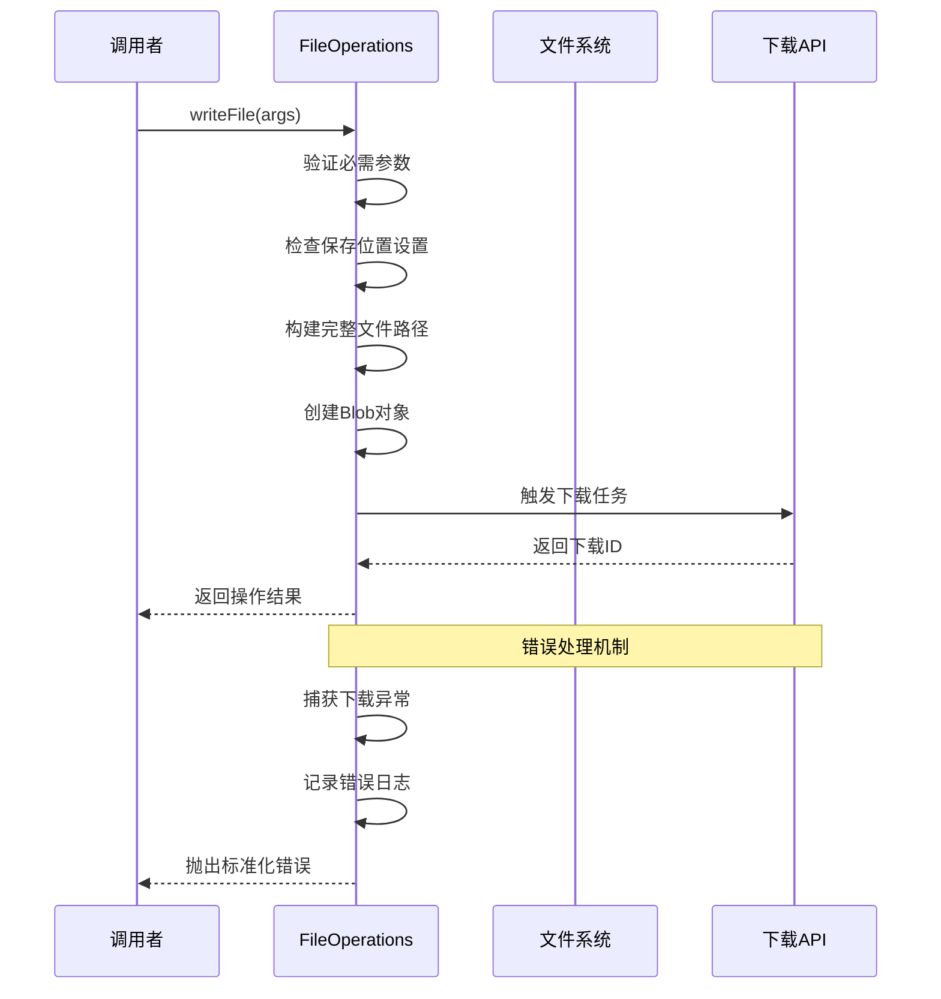
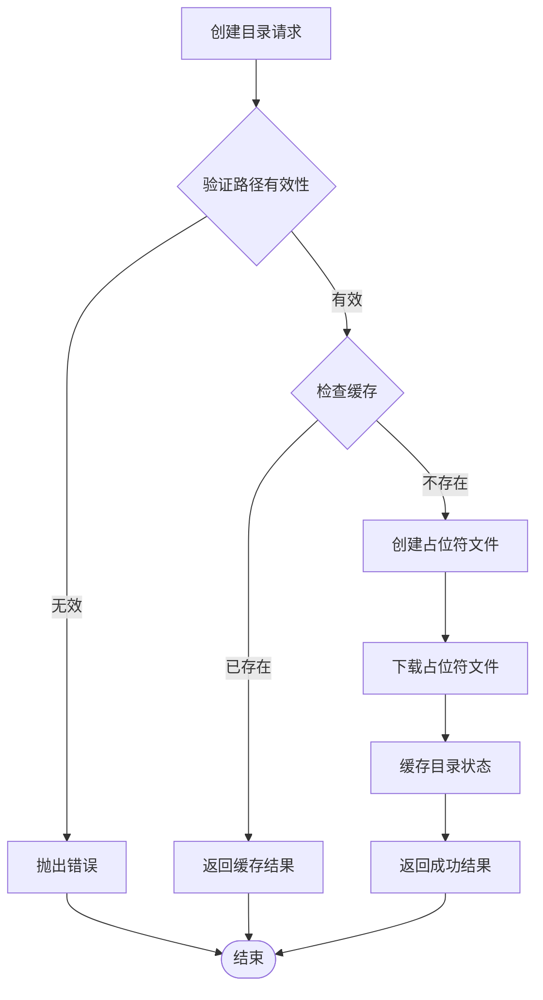
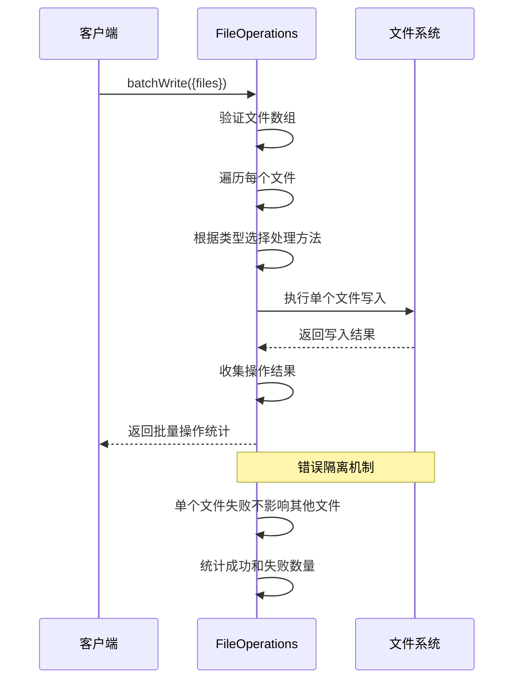
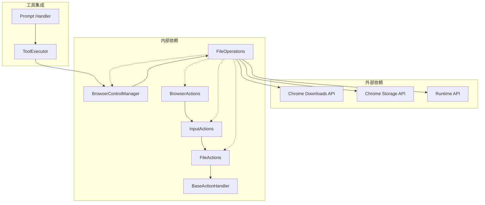

# 文件操作功能

<cite>
**本文档引用的文件**
- [file_operations.js](file://background/control/file_operations.js)
- [control_manager.js](file://background/managers/control_manager.js)
- [actions.js](file://background/control/actions.js)
- [input.js](file://background/control/actions/input.js)
- [file.js](file://background/control/actions/input/file.js)
- [base.js](file://background/control/actions/base.js)
- [observation.js](file://background/control/actions/observation.js)
- [snapshot.js](file://background/control/snapshot.js)
- [manifest.json](file://manifest.json)
- [tool_executor.js](file://background/handlers/session/prompt/tool_executor.js)
</cite>

## 目录
1. [简介](#简介)
2. [项目结构](#项目结构)
3. [核心组件](#核心组件)
4. [架构概览](#架构概览)
5. [详细组件分析](#详细组件分析)
6. [依赖关系分析](#依赖关系分析)
7. [性能考虑](#性能考虑)
8. [故障排除指南](#故障排除指南)
9. [结论](#结论)

## 简介

文件操作功能是 Gemini Nexus Chrome 扩展程序中的一个核心模块，它为 AI 工作空间提供了完整的文件管理能力。该功能允许 AI 智能体保存收集的数据、文件和内容到用户指定的位置，支持多种文件格式（文本、JSON、CSV、Markdown）以及目录管理。

该系统基于 Chrome 扩展的下载 API 和存储 API 构建，提供了从简单的文件写入到复杂的批量操作的完整功能集。通过与浏览器控制管理器的集成，文件操作功能能够无缝地融入 AI 自动化工作流程中。

## 项目结构

文件操作功能在项目中的组织结构如下：

**图表来源**
- [file_operations.js](file://background/control/file_operations.js#L7-L421)
- [control_manager.js](file://background/managers/control_manager.js#L16-L28)
- [actions.js](file://background/control/actions.js#L13-L55)

**章节来源**
- [file_operations.js](file://background/control/file_operations.js#L1-L421)
- [control_manager.js](file://background/managers/control_manager.js#L1-L622)

## 核心组件

文件操作功能由以下核心组件构成：

### FileOperations 主控制器
- **职责**: 提供统一的文件操作接口
- **特性**: 支持多种文件格式、路径管理、错误处理
- **初始化**: 加载用户偏好设置和工作空间配置

### 文件写入方法
- **writeFile()**: 通用文件写入方法
- **writeJSON()**: JSON 数据序列化写入
- **writeCSV()**: 结构化数据 CSV 格式化写入
- **writeMarkdown()**: Markdown 内容写入

### 辅助功能
- **appendFile()**: 文件追加（通过时间戳版本化）
- **createDirectory()**: 目录创建（使用占位符文件）
- **listFiles()**: 下载历史文件列表
- **batchWrite()**: 批量文件写入操作

**章节来源**
- [file_operations.js](file://background/control/file_operations.js#L7-L421)

## 架构概览

文件操作功能采用分层架构设计，确保了良好的可维护性和扩展性：

**图表来源**
- [control_manager.js](file://background/managers/control_manager.js#L428-L458)
- [file_operations.js](file://background/control/file_operations.js#L45-L101)

**章节来源**
- [control_manager.js](file://background/managers/control_manager.js#L267-L495)

## 详细组件分析

### FileOperations 类分析

FileOperations 是整个文件操作功能的核心类，提供了完整的文件管理能力：

**图表来源**
- [file_operations.js](file://background/control/file_operations.js#L7-L421)
- [control_manager.js](file://background/managers/control_manager.js#L16-L28)
- [base.js](file://background/control/actions/base.js#L5-L64)
- [file.js](file://background/control/actions/input/file.js#L5-L31)

#### 初始化流程

文件操作器的初始化过程包括加载用户偏好设置和验证环境：

**图表来源**
- [file_operations.js](file://background/control/file_operations.js#L18-L38)

#### 文件写入流程

通用文件写入方法实现了完整的文件保存流程：

**图表来源**
- [file_operations.js](file://background/control/file_operations.js#L45-L101)

**章节来源**
- [file_operations.js](file://background/control/file_operations.js#L45-L421)

### 文件格式支持

文件操作功能支持多种文件格式，每种格式都有专门的处理逻辑：

#### JSON 文件处理
- **序列化选项**: 支持美化输出和紧凑格式
- **编码处理**: 自动处理 Unicode 字符
- **错误处理**: 参数验证和异常捕获

#### CSV 文件处理
- **数据验证**: 确保输入为数组格式
- **头部支持**: 可选的列标题
- **转义机制**: 正确处理特殊字符和逗号

#### Markdown 文件处理
- **纯文本处理**: 直接写入 Markdown 内容
- **格式保持**: 保留原始格式和结构

**章节来源**
- [file_operations.js](file://background/control/file_operations.js#L107-L177)

### 目录管理功能

文件操作功能提供了虚拟的目录管理能力：

**图表来源**
- [file_operations.js](file://background/control/file_operations.js#L204-L262)

**章节来源**
- [file_operations.js](file://background/control/file_operations.js#L204-L262)

### 批量操作功能

批量写入功能提供了高效的多文件操作能力：

**图表来源**
- [file_operations.js](file://background/control/file_operations.js#L375-L419)

**章节来源**
- [file_operations.js](file://background/control/file_operations.js#L375-L419)

## 依赖关系分析

文件操作功能的依赖关系体现了清晰的分层架构：

**图表来源**
- [file_operations.js](file://background/control/file_operations.js#L21-L22)
- [control_manager.js](file://background/managers/control_manager.js#L10-L10)
- [tool_executor.js](file://background/handlers/session/prompt/tool_executor.js#L22-L25)

**章节来源**
- [manifest.json](file://manifest.json#L6-L6)
- [control_manager.js](file://background/managers/control_manager.js#L1-L622)

### 权限要求

文件操作功能需要以下 Chrome 扩展权限：

| 权限名称 | 用途 | 安全级别 |
|---------|------|----------|
| `downloads` | 文件下载和管理 | 高风险 |
| `storage` | 用户偏好设置存储 | 中等风险 |
| `scripting` | 动态脚本注入 | 中等风险 |
| `debugger` | 页面调试控制 | 高风险 |

**章节来源**
- [manifest.json](file://manifest.json#L6-L6)

## 性能考虑

文件操作功能在设计时充分考虑了性能优化：

### 缓存策略
- **目录缓存**: 使用 Set 数据结构缓存已创建的目录
- **会话级缓存**: 在单次会话中避免重复的目录创建操作
- **路径规范化**: 统一路径格式减少比较开销

### 异步处理
- **非阻塞操作**: 所有文件操作都是异步执行
- **并发控制**: 批量操作中的单个文件失败不影响整体流程
- **超时处理**: 合理的超时机制防止长时间阻塞

### 内存管理
- **Blob 对象**: 使用 Blob 对象处理大文件内容
- **数据 URL**: 临时转换为 Data URL 进行下载
- **及时清理**: 操作完成后及时释放内存资源

## 故障排除指南

### 常见问题及解决方案

#### 文件下载失败
**症状**: 文件写入操作抛出异常
**可能原因**:
- 浏览器下载权限被拒绝
- 磁盘空间不足
- 文件名包含非法字符

**解决步骤**:
1. 检查浏览器下载设置
2. 验证目标磁盘空间
3. 使用安全的文件名字符

#### 目录创建失败
**症状**: createDirectory 返回失败状态
**可能原因**:
- 路径包含非法字符
- 权限不足
- Chrome 扩展限制

**解决步骤**:
1. 验证路径格式
2. 检查用户权限
3. 尝试简化路径结构

#### 批量操作部分失败
**症状**: batchWrite 返回混合结果
**处理方式**:
- 检查单个文件的错误详情
- 独立测试失败的文件
- 查看日志输出

**章节来源**
- [file_operations.js](file://background/control/file_operations.js#L97-L100)
- [file_operations.js](file://background/control/file_operations.js#L253-L261)

### 调试技巧

#### 启用详细日志
- 监控控制台输出
- 检查网络请求状态
- 验证文件下载历史

#### 性能监控
- 监控内存使用情况
- 检查异步操作完成时间
- 分析批量操作效率

## 结论

文件操作功能为 Gemini Nexus Chrome 扩展程序提供了强大而灵活的文件管理能力。通过精心设计的架构和完善的错误处理机制，该功能能够满足 AI 智能体在各种场景下的文件操作需求。

主要优势包括：
- **多格式支持**: 全面的文件格式处理能力
- **用户友好**: 支持自定义工作空间和保存位置
- **可靠性强**: 完善的错误处理和恢复机制
- **性能优化**: 高效的缓存策略和异步处理

未来可以考虑的功能增强：
- 更丰富的文件格式支持
- 增强的文件同步功能
- 更细粒度的权限控制
- 改进的批量操作性能

该文件操作功能作为 Chrome 扩展生态系统中的重要组成部分，为 AI 自动化应用提供了坚实的基础支撑。