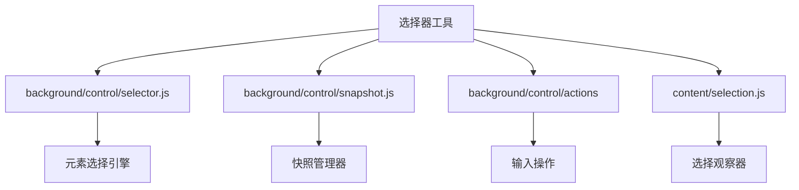
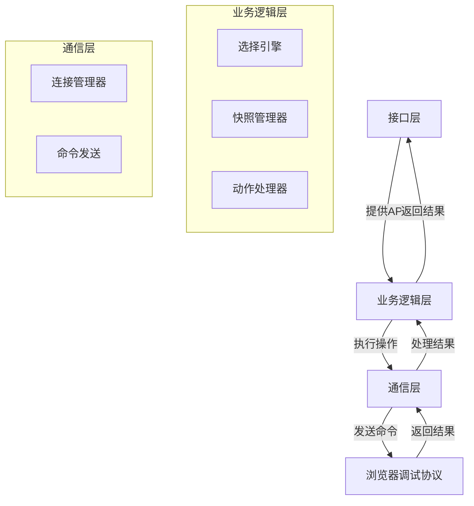
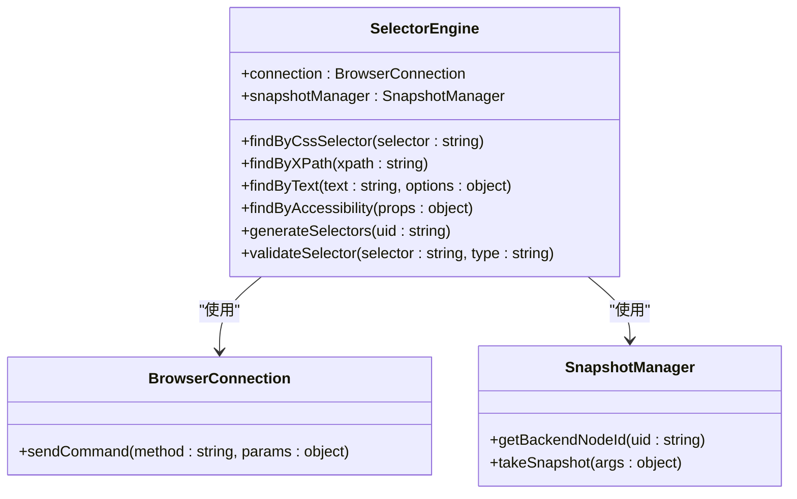
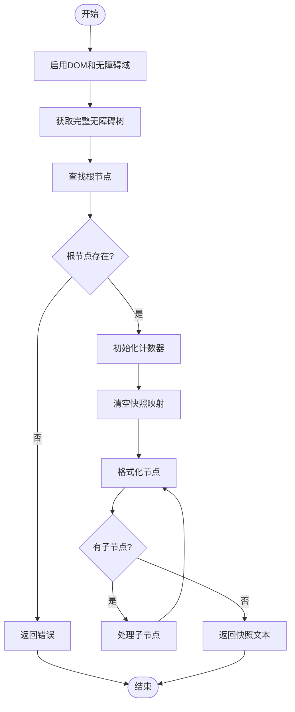
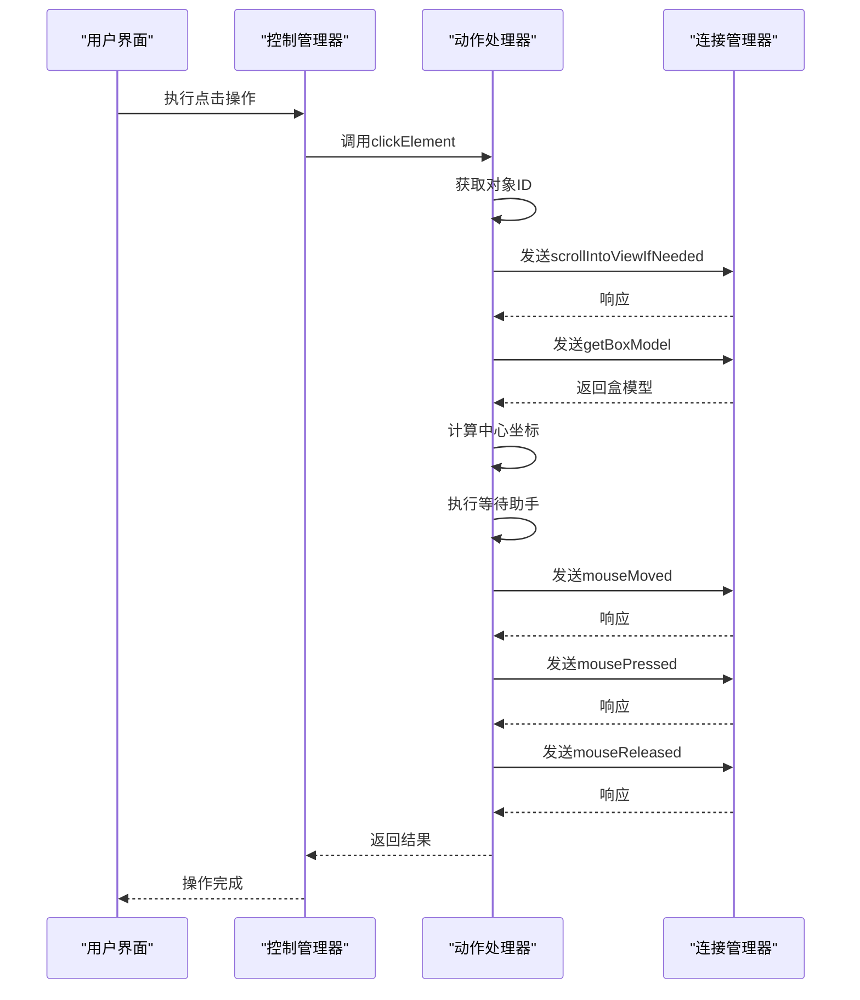
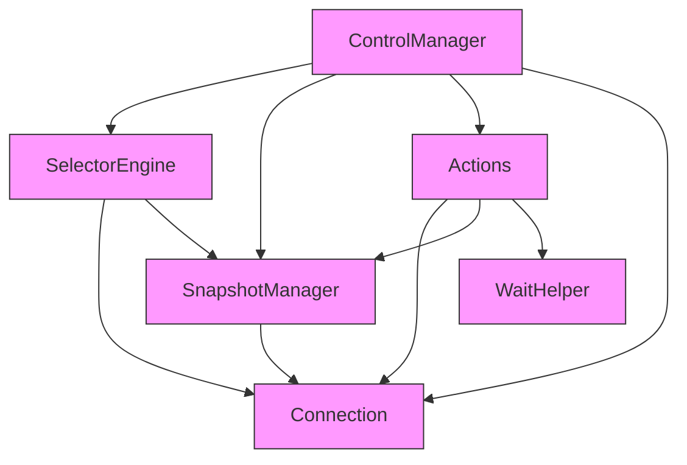

# 选择器工具

<cite>
**本文档中引用的文件**  
- [selector.js](file://background/control/selector.js)
- [snapshot.js](file://background/control/snapshot.js)
- [control_manager.js](file://background/managers/control_manager.js)
- [mouse.js](file://background/control/actions/input/mouse.js)
- [keyboard.js](file://background/control/actions/input/keyboard.js)
- [file.js](file://background/control/actions/input/file.js)
- [base.js](file://background/control/actions/base.js)
- [connection.js](file://background/control/connection.js)
- [selection.js](file://content/selection.js)
</cite>

## 目录
1. [简介](#简介)
2. [项目结构](#项目结构)
3. [核心组件](#核心组件)
4. [架构概述](#架构概述)
5. [详细组件分析](#详细组件分析)
6. [依赖分析](#依赖分析)
7. [性能考虑](#性能考虑)
8. [故障排除指南](#故障排除指南)
9. [结论](#结论)

## 简介
选择器工具是Gemini浏览器自动化扩展中的核心功能模块，负责实现对网页元素的精准定位和选择。该工具通过多种选择策略，为自动化操作提供可靠的目标元素识别能力。系统采用模块化设计，结合了UID映射、快照管理和DOM操作等关键技术，实现了高效、准确的元素选择功能。

## 项目结构
选择器工具主要分布在`background/control`目录下，其核心文件包括`selector.js`、`snapshot.js`和`actions`子目录中的相关文件。该工具与内容脚本`content/selection.js`协同工作，形成完整的元素选择解决方案。

**Diagram sources**
- [selector.js](file://background/control/selector.js)
- [snapshot.js](file://background/control/snapshot.js)
- [mouse.js](file://background/control/actions/input/mouse.js)
- [selection.js](file://content/selection.js)

**Section sources**
- [selector.js](file://background/control/selector.js)
- [snapshot.js](file://background/control/snapshot.js)

## 核心组件
选择器工具的核心组件包括选择引擎、快照管理器和动作处理器。选择引擎提供多种选择方法，快照管理器负责维护DOM元素的UID映射，动作处理器则执行具体的用户交互操作。这些组件通过连接管理器与浏览器调试协议进行通信，实现对网页元素的精确控制。

**Section sources**
- [selector.js](file://background/control/selector.js)
- [snapshot.js](file://background/control/snapshot.js)
- [base.js](file://background/control/actions/base.js)

## 架构概述
选择器工具采用分层架构设计，从上到下分为接口层、业务逻辑层和通信层。接口层提供统一的API供外部调用，业务逻辑层实现具体的选择算法和操作逻辑，通信层负责与浏览器调试协议进行交互。

**Diagram sources**
- [selector.js](file://background/control/selector.js)
- [snapshot.js](file://background/control/snapshot.js)
- [base.js](file://background/control/actions/base.js)
- [connection.js](file://background/control/connection.js)

## 详细组件分析

### 选择引擎分析
选择引擎是选择器工具的核心，提供多种元素选择方法，包括CSS选择器、XPath、文本匹配和无障碍属性匹配。

#### 选择引擎类图

**Diagram sources**
- [selector.js](file://background/control/selector.js)
- [connection.js](file://background/control/connection.js)
- [snapshot.js](file://background/control/snapshot.js)

### 快照管理器分析
快照管理器负责生成和维护DOM元素的快照，为选择器工具提供UID到后端节点ID的映射。

#### 快照管理器流程图

**Diagram sources**
- [snapshot.js](file://background/control/snapshot.js)

**Section sources**
- [snapshot.js](file://background/control/snapshot.js)

### 动作处理器分析
动作处理器负责执行具体的用户交互操作，如点击、填充和拖拽等。

#### 鼠标操作序列图

**Diagram sources**
- [mouse.js](file://background/control/actions/input/mouse.js)
- [base.js](file://background/control/actions/base.js)
- [connection.js](file://background/control/connection.js)

**Section sources**
- [mouse.js](file://background/control/actions/input/mouse.js)
- [base.js](file://background/control/actions/base.js)

## 依赖分析
选择器工具依赖于多个核心组件，包括连接管理器、快照管理器和各种动作处理器。这些组件通过明确的接口进行交互，形成了一个松耦合的系统架构。

**Diagram sources**
- [control_manager.js](file://background/managers/control_manager.js)
- [selector.js](file://background/control/selector.js)
- [snapshot.js](file://background/control/snapshot.js)
- [actions.js](file://background/control/actions.js)
- [connection.js](file://background/control/connection.js)

**Section sources**
- [control_manager.js](file://background/managers/control_manager.js)

## 性能考虑
选择器工具在设计时充分考虑了性能因素。通过使用UID映射避免重复的DOM查询，利用快照机制减少与浏览器的通信次数，并采用异步操作确保UI的响应性。此外，工具还实现了错误重试机制和用户干预功能，提高了自动化操作的鲁棒性。

## 故障排除指南
当选择器工具出现问题时，可以按照以下步骤进行排查：
1. 检查浏览器调试会话是否正常连接
2. 验证目标元素是否存在于当前页面
3. 确认选择器语法是否正确
4. 检查是否有遮挡元素阻止交互
5. 查看控制台日志获取详细错误信息

**Section sources**
- [selector.js](file://background/control/selector.js)
- [mouse.js](file://background/control/actions/input/mouse.js)
- [keyboard.js](file://background/control/actions/input/keyboard.js)

## 结论
选择器工具是一个功能强大且设计精良的浏览器自动化组件。它通过多种选择策略和稳健的错误处理机制，为自动化操作提供了可靠的元素定位能力。系统的模块化设计和清晰的接口定义，使得工具易于维护和扩展。未来可以考虑增加更多选择方法和优化性能，进一步提升用户体验。