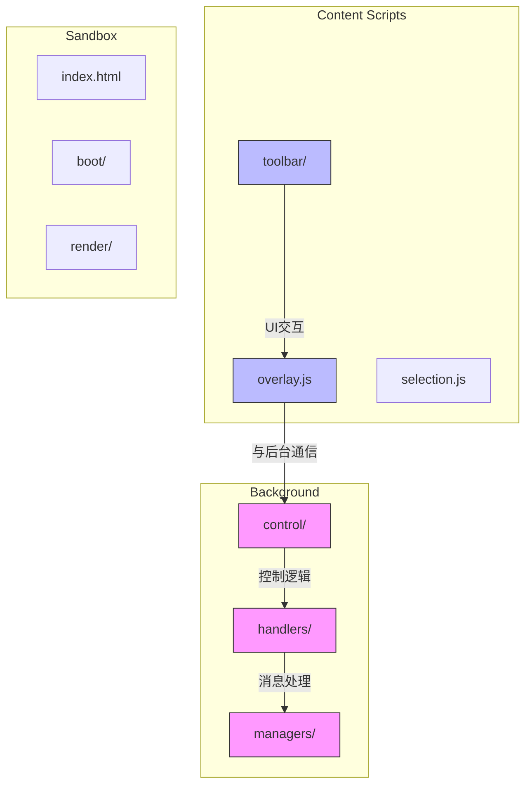
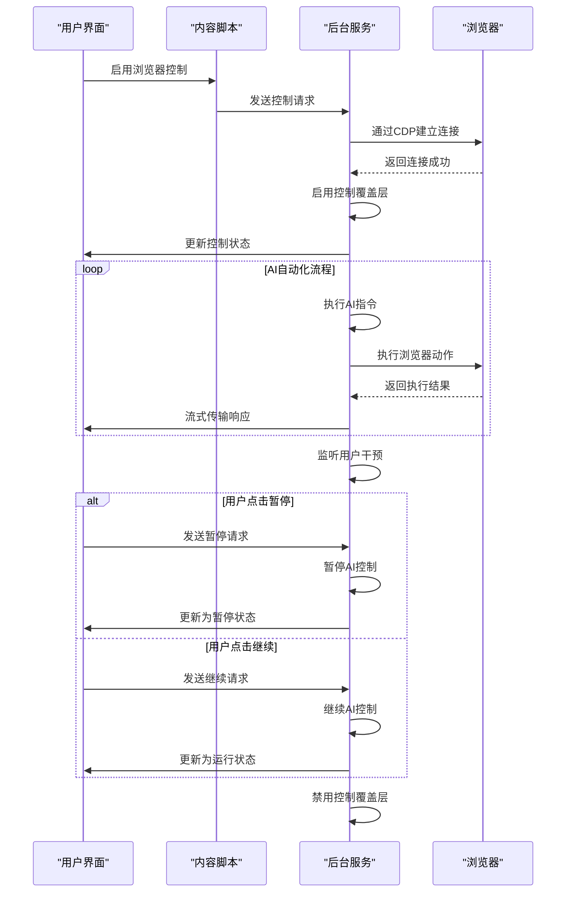
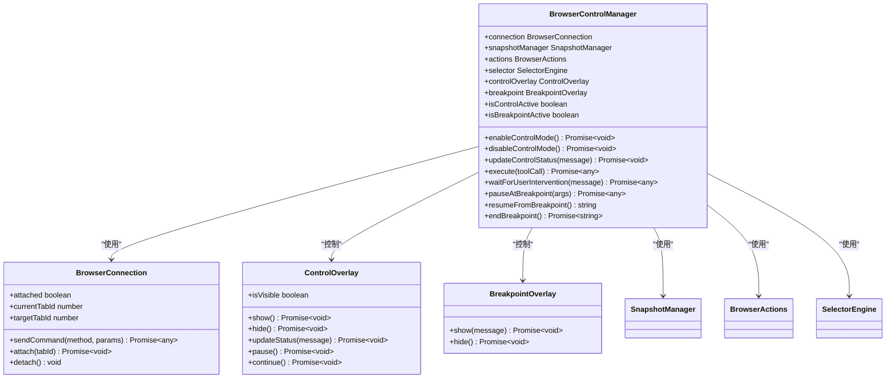
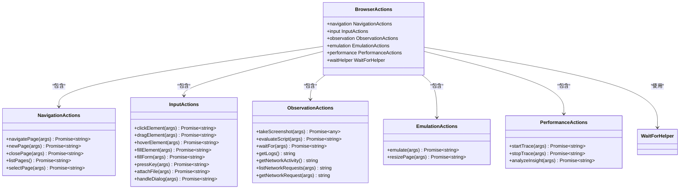
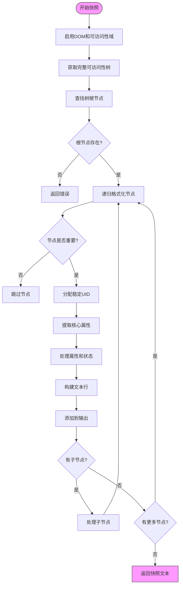
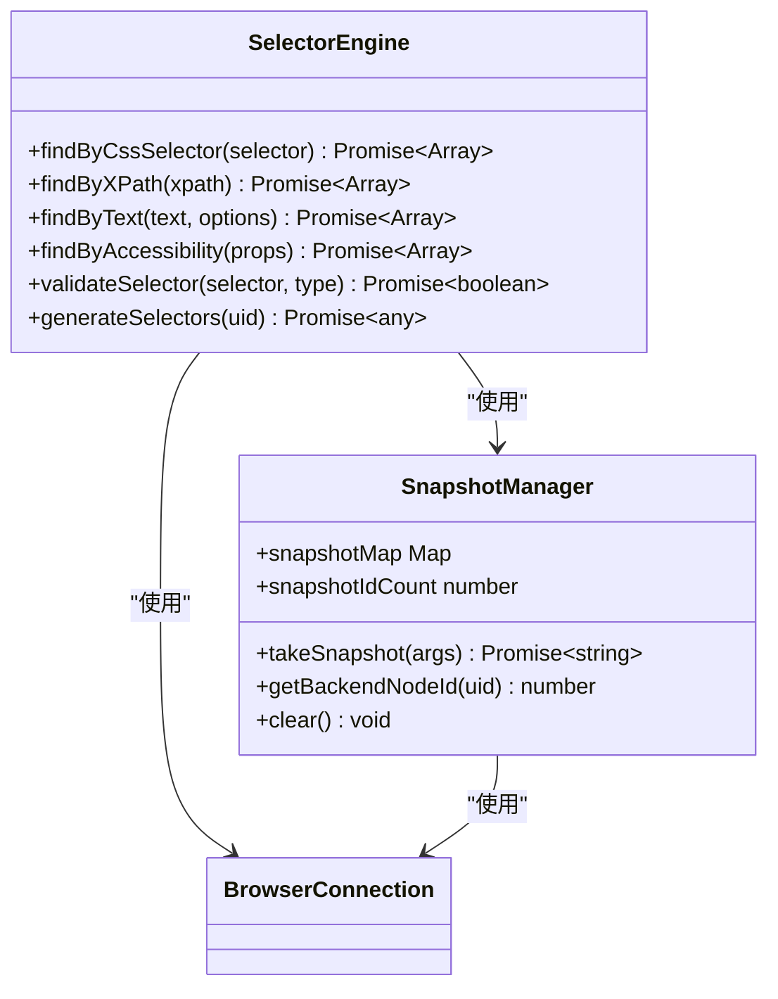
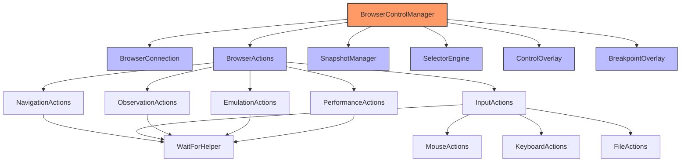

# AI控制覆盖层

<cite>
**本文档中引用的文件**  
- [control_manager.js](file://background/managers/control_manager.js)
- [control_overlay.js](file://background/control/control_overlay.js)
- [breakpoint_overlay.js](file://background/control/breakpoint_overlay.js)
- [actions.js](file://background/control/actions.js)
- [snapshot.js](file://background/control/snapshot.js)
- [selector.js](file://background/control/selector.js)
- [index.js](file://background/index.js)
- [session_manager.js](file://background/managers/session_manager.js)
- [prompt_handler.js](file://background/handlers/session/prompt_handler.js)
- [controller.js](file://content/toolbar/controller.js)
</cite>

## 目录
1. [简介](#简介)
2. [项目结构](#项目结构)
3. [核心组件](#核心组件)
4. [架构概述](#架构概述)
5. [详细组件分析](#详细组件分析)
6. [依赖分析](#依赖分析)
7. [性能考虑](#性能考虑)
8. [故障排除指南](#故障排除指南)
9. [结论](#结论)

## 简介
"AI控制覆盖层"是Gemini Nexus Chrome扩展的核心功能，允许AI代理直接控制浏览器执行各种任务。该系统通过复杂的覆盖层和控制机制，实现了人机协作的自动化流程。当AI执行浏览器操作时，控制覆盖层会显示在页面上，提供实时状态反馈，并允许用户在必要时暂停或继续自动化过程。

## 项目结构
该项目采用模块化的架构设计，将不同功能分离到独立的目录中。核心的AI控制功能主要位于`background/control/`目录下，而用户界面相关的代码则分布在`content/`和`background/handlers/`等目录中。

**Diagram sources**
- [background/control/](file://background/control/)
- [background/handlers/](file://background/handlers/)
- [content/](file://content/)

**Section sources**
- [README.md](file://README.md#L50-L66)
- [manifest.json](file://manifest.json#L1-L93)

## 核心组件
AI控制覆盖层的核心由多个协同工作的组件构成，包括控制管理器、动作执行器、快照管理器和选择器引擎。这些组件共同实现了AI对浏览器的精确控制能力。控制管理器负责协调整个控制流程，从启用控制模式到执行具体动作，再到处理用户干预。动作执行器则封装了各种浏览器操作，如导航、点击、输入等，为AI提供了丰富的操作接口。

**Section sources**
- [control_manager.js](file://background/managers/control_manager.js#L16-L622)
- [actions.js](file://background/control/actions.js#L13-L55)

## 架构概述
AI控制覆盖层的架构基于Chrome扩展的多进程模型，利用后台服务工作线程、内容脚本和沙箱环境的协同工作来实现安全且强大的浏览器控制功能。系统通过Chrome DevTools协议（CDP）与浏览器进行深度交互，获取页面的可访问性树并执行DOM操作。

**Diagram sources**
- [control_manager.js](file://background/managers/control_manager.js#L16-L622)
- [index.js](file://background/index.js#L1-L30)
- [controller.js](file://content/toolbar/controller.js#L7-L403)

## 详细组件分析

### 控制管理器分析
控制管理器是AI控制覆盖层的大脑，负责管理整个控制流程的生命周期。它不仅处理AI指令的执行，还管理控制覆盖层的显示状态和用户交互。

**Diagram sources**
- [control_manager.js](file://background/managers/control_manager.js#L16-L622)
- [connection.js](file://background/control/connection.js#L1-L100)
- [control_overlay.js](file://background/control/control_overlay.js#L1-L100)

**Section sources**
- [control_manager.js](file://background/managers/control_manager.js#L16-L622)

### 动作执行器分析
动作执行器为AI提供了执行各种浏览器操作的能力，它通过模块化的设计将不同类型的动作分离到独立的子模块中。

**Diagram sources**
- [actions.js](file://background/control/actions.js#L13-L55)
- [navigation.js](file://background/control/actions/navigation.js#L5-L61)
- [input.js](file://background/control/actions/input.js#L8-L62)
- [observation.js](file://background/control/actions/observation.js#L5-L200)

**Section sources**
- [actions.js](file://background/control/actions.js#L13-L55)

### 快照与选择器分析
快照管理器和选择器引擎共同实现了AI对页面元素的识别和定位能力。快照管理器将复杂的DOM结构转换为AI可理解的文本树，而选择器引擎则提供了多种方式来查找和验证页面元素。

**Diagram sources**
- [snapshot.js](file://background/control/snapshot.js#L9-L183)
- [selector.js](file://background/control/selector.js#L9-L252)

**Section sources**
- [snapshot.js](file://background/control/snapshot.js#L9-L183)
- [selector.js](file://background/control/selector.js#L9-L252)

## 依赖分析
AI控制覆盖层的各个组件之间存在复杂的依赖关系，这些依赖关系确保了系统的稳定性和可维护性。控制管理器作为核心组件，依赖于多个底层服务，包括连接管理、动作执行、快照生成和UI覆盖层。

**Diagram sources**
- [control_manager.js](file://background/managers/control_manager.js#L16-L622)
- [actions.js](file://background/control/actions.js#L13-L55)
- [snapshot.js](file://background/control/snapshot.js#L9-L183)
- [selector.js](file://background/control/selector.js#L9-L252)
- [control_overlay.js](file://background/control/control_overlay.js#L1-L100)
- [breakpoint_overlay.js](file://background/control/breakpoint_overlay.js#L1-L100)

**Section sources**
- [control_manager.js](file://background/managers/control_manager.js#L16-L622)

## 性能考虑
AI控制覆盖层在设计时充分考虑了性能因素，通过多种机制确保系统的响应速度和资源效率。系统采用轮询机制来检测用户干预请求，轮询间隔设置为300毫秒，既保证了响应的及时性，又避免了过高的CPU占用。快照生成过程经过优化，只包含对AI决策有重要意义的页面元素，大大减少了数据传输量和处理时间。

**Section sources**
- [control_manager.js](file://background/managers/control_manager.js#L104-L131)
- [snapshot.js](file://background/control/snapshot.js#L80-L93)

## 故障排除指南
当AI控制覆盖层出现问题时，可以按照以下步骤进行排查：

1. **检查扩展权限**：确保扩展已获得必要的权限，特别是`debugger`权限，这是建立CDP连接所必需的。
2. **验证页面兼容性**：某些特殊页面（如chrome://开头的页面）不支持调试器连接，AI控制功能将无法启用。
3. **检查网络连接**：确保与Gemini API的通信正常，网络问题可能导致AI指令无法发送或接收。
4. **查看控制覆盖层状态**：如果控制覆盖层未显示，检查控制管理器的`isControlActive`状态，确认控制模式是否已正确启用。
5. **检查错误日志**：在Chrome开发者工具中查看后台服务工作线程的日志，寻找可能的错误信息。

**Section sources**
- [control_manager.js](file://background/managers/control_manager.js#L36-L39)
- [session_manager.js](file://background/managers/session_manager.js#L127-L175)

## 结论
AI控制覆盖层是Gemini Nexus扩展中一个强大而复杂的功能，它通过精心设计的架构和组件协作，实现了AI对浏览器的安全、可控操作。该系统不仅提供了丰富的浏览器控制能力，还通过直观的覆盖层界面实现了人机协作的无缝集成。通过模块化的设计和清晰的依赖关系，系统具有良好的可维护性和扩展性，为未来的功能增强奠定了坚实的基础。